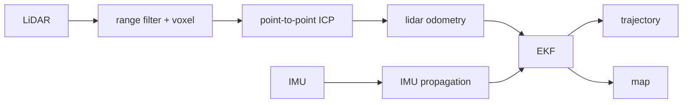
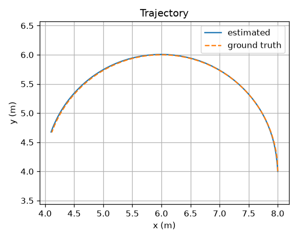
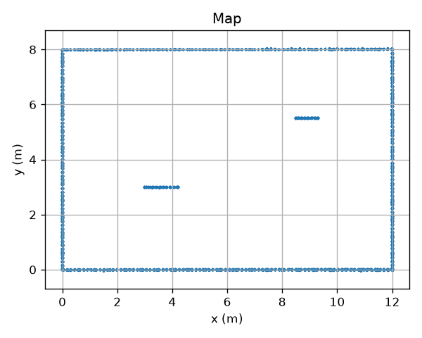

# LiDAR-Inertial State Estimation and Mapping

This is our group project. We write a C++ program for lidar-inertial odometry and mapping.

## What we implemented

- point cloud preprocess: range filter and voxel downsample
- point-to-point ICP (KD-tree nearest neighbour + SVD)
- scan-to-scan lidar odometry
- IMU propagation
- simple error-state EKF
- global voxel map
- trajectory plot and RMSE

## Architecture



LiDAR path: filter points, then ICP match scan k to scan k-1. Relative pose is chained, this is lidar odometry.

IMU path: integrate gyro and accel, predict pose / velocity / bias.

EKF: IMU predict, lidar pose update. Fused pose is used to put points into the map.

## Method

Rigid transform:

```
p' = R p + t
```

ICP:

```
T* = argmin_T  sum || T p_i - q_i ||^2
```

Nearest point is found by KD-tree. Then SVD gives R and t.

IMU:

```
R = R * Exp((w - bg) * dt)
a = R * (acc - ba) + g
v = v + a * dt
p = p + v * dt
```

EKF error state is 15 dim: dp, dv, dtheta, dba, dbg.

```
predict:  x = f(x, imu),  P = F P F^T + Q
update:   y = z_lidar - h(x)
          K = P H^T (H P H^T + R)^{-1}
          x = x + K y
```

## Result

The demo is a circle path in a room.

ATE RMSE: 0.014 m





## Build and run

Need cmake, Eigen and PCL.

```bash
cmake -S . -B build
cmake --build build -j
./build/lio_demo --output output
```

```bash
python3 -m venv .venv
source .venv/bin/activate
pip install -r requirements.txt
python scripts/plot_trajectory.py
python scripts/evaluate_trajectory.py
```

```bash
cd build && ctest
```

## Files

```
include/   headers
src/       cpp code
tests/
scripts/   plot and error
data/sample/
```

`imu.csv`: `timestamp,ax,ay,az,gx,gy,gz`

`ground_truth.csv`: `timestamp,x,y,z,qx,qy,qz,qw`

LiDAR: one pcd for one scan.
